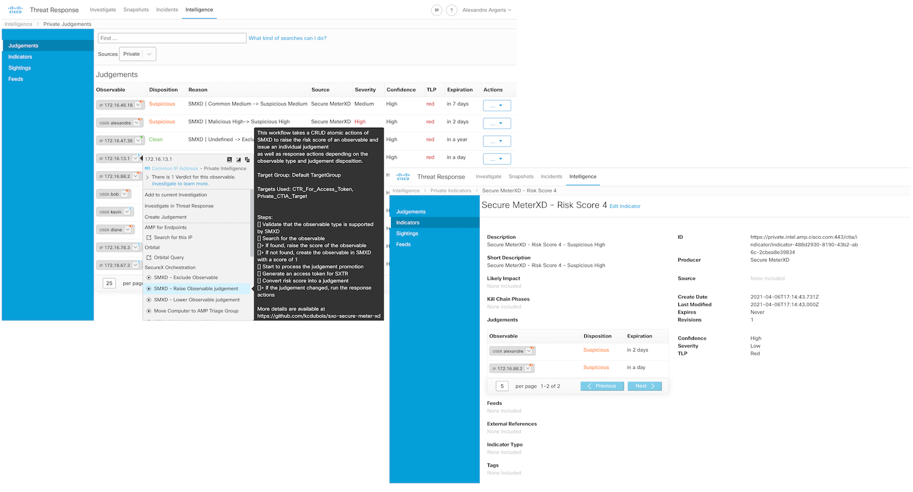
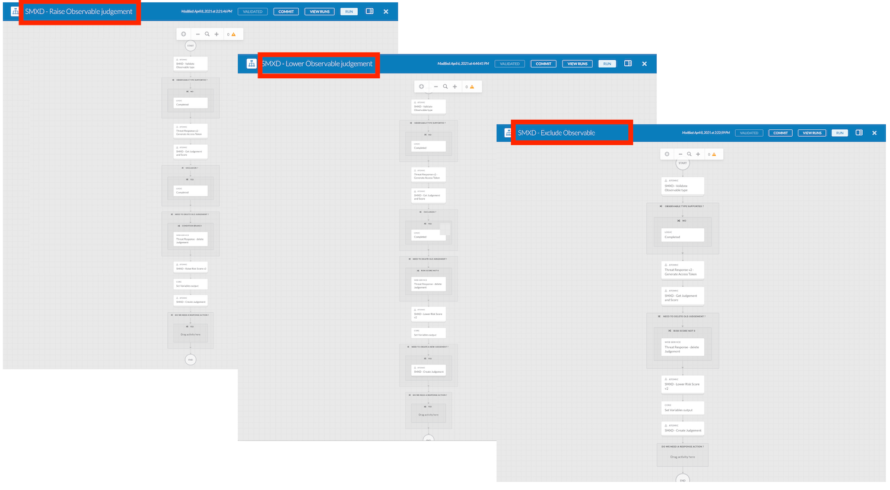
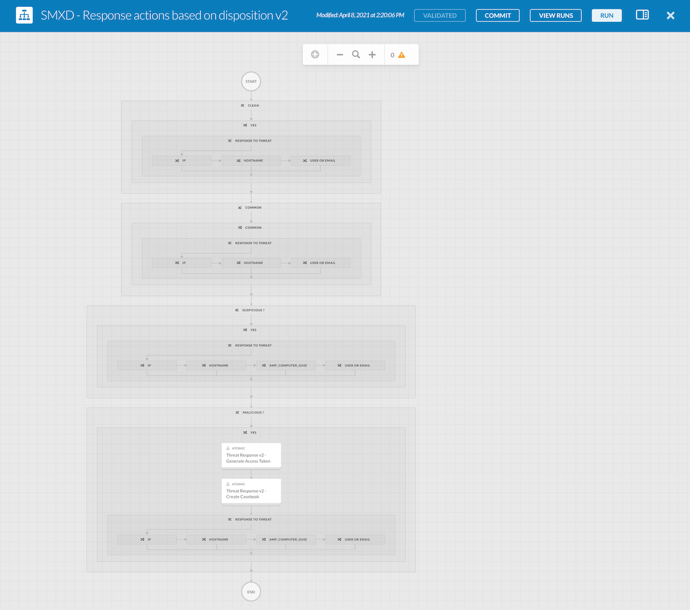
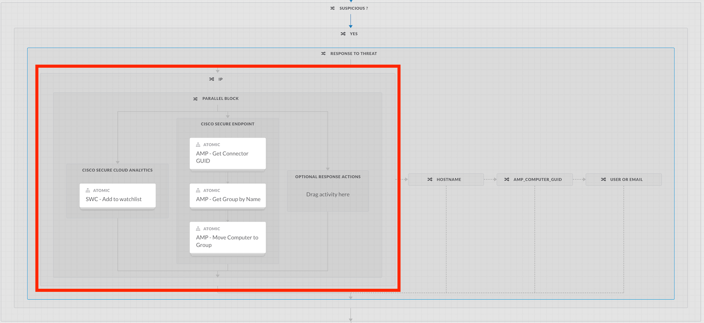
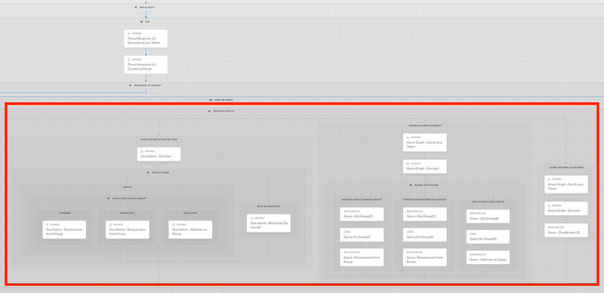

# Secure Meter XD - _SecureX Orchestrator Hackaton_ 

Secure Meter XD (written **SMXD**) is an automated private security intelligence store to help automate internal observable judgements to improve alert fidelity and automated response inside of SecureX Orchestrator.


<br/> 


## Supported workflows


<br/> 

* ```SMXD - Raise Observable judgement ```
* ```SMXD - Lower Observable judgement ```
* ```SMXD - Exclude Observable```

## Optional workflow


<br/> 

* ```SMXD - Response actions based on disposition v2 ```

#### Examples of Threat Responses


<br/> 


<br/> 

## Required Atomic actions
* ```SMXD - Raise Risk Score v2 ```
* ```SMXD - Lower Risk Score v2 ```
* ```SMXD - Validate Observable Type ```
* ```SMXD - Get Judgement and Score ```
* ```SMXD - Create Judgement ```
* ```Threat Reponse v2 - Generate Access Token ```

## Getting Started
To start using SMXD in your SecureX environment, here are the steps:
* Import all the Atomic actions (https://ciscosecurity.github.io/sxo-05-security-workflows/configuration)
* Add this Github repository to your list of Git repository in SXO
* Import all the workflows and atomic actions
