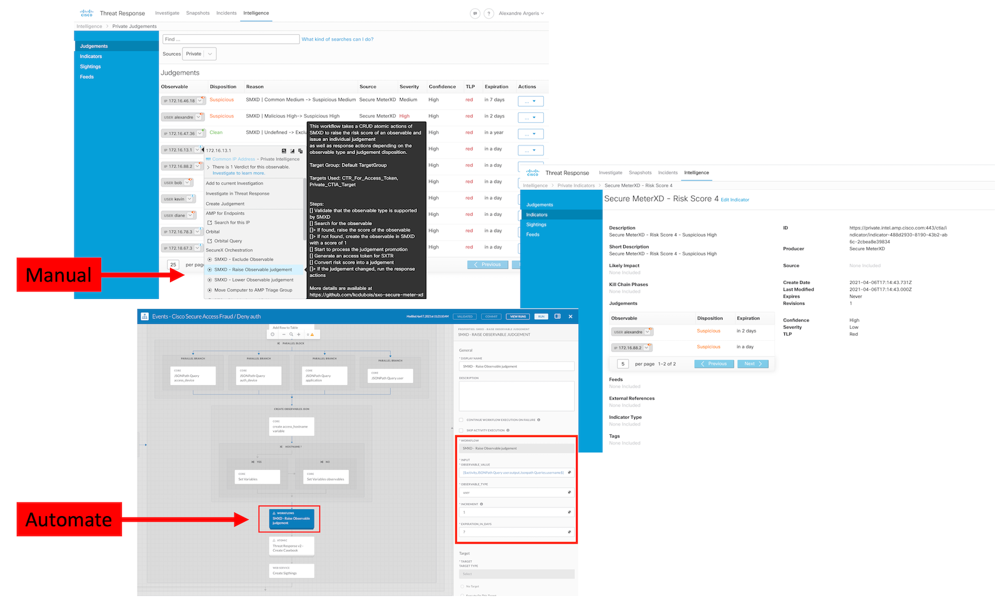
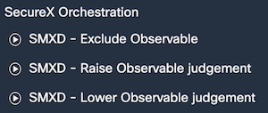
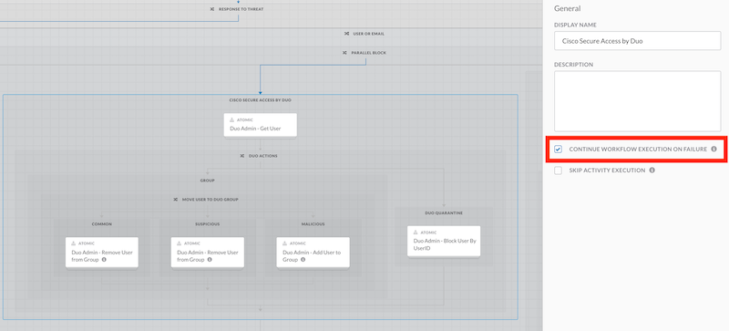
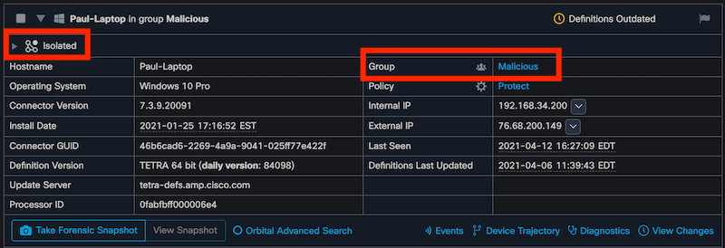

# Secure Meter XD - _SecureX Orchestrator Hackaton_ 


<br/> 

Secure Meter XD (written **SMXD**) is an automated private security intelligence framework to help automate internal observable judgements to improve alert fidelity and automated response inside of SecureX Orchestrator.

### Supported Observable types
- ip (with validation for RFC 1918 for private IP)
- hostname
- username
- email (with validation for email with email domain from the organization)
- amp_computer_guid
- mac_address


<br/> 


## Supported workflows

* ```SMXD - Raise Observable judgement ```
* ```SMXD - Lower Observable judgement ```
* ```SMXD - Exclude Observable```


<br/> 

##### Variables to be modify in each workflows
- Increment / Decrement
- Expiration_in_days
- email_domain

## Required atomic actions
* ```SMXD - Raise Risk Score v2 ```
* ```SMXD - Lower Risk Score v2 ```
* ```SMXD - Validate Observable Type ```
* ```SMXD - Get Judgement and Score ```
* ```SMXD - Create Judgement ```
* ```Threat Reponse v2 - Generate Access Token ```

## Getting Started
To start using SMXD in your SecureX environment, here are the steps:
* Import all the Atomic actions (https://ciscosecurity.github.io/sxo-05-security-workflows/configuration)
* Add this Github repository to your list of Git repository in SXO
* Import all the workflows and atomic actions

#### how to use it
Secure Meter XD can be use manually by clicking on "Exclude", "Raise" or "lower" workflows on the contextuel menu of SecureX.


<br/>

Secure Meter XD can also be added to any existing workflow where internal observables are collected or identified. The "Increment" variable can be modify from 1 to 5 to represent to criticality of the security events for the identified internal observable. The "Expiration_in_Days" set the expiration time frame for CTIA Judgement creation.


<br/>

If your existing workflow output Observables JSON, here who you can integrate SMXD.


<br/>


#### Optional response workflow

At the end of each SMXD worflows an optional response workflow can be add to response to threat based on the disposition of the internal observable.


<br/> 

* ```SMXD - Response actions based on disposition v2 ```


<br/> 

#### Examples of Threat Responses


<br/> 


<br/> 

"SMXD - Response actions based on disposition v2" workflow is a very flexible and will run even if you do not have a subscription for some of theses Cisco response action.

<br/>

The workflow come with pre-config response actions:
- Cisco Secure Cloud Analytics, add "IP" to IP watchlist

<br/>

- Cisco Secure Endpoint, move device to a other group - isolate a device

<br/>

- Cisco Secure Access by Duo, move user to a Duo local group - disable a user

<br/>

- Microsoft Azure AD, add / remove user from group - Block sing in

<br/>

- Email notification and Cisco SecureX casebook

And it include section to add your own response action from a Third-party per example.


<br/>

#### Optional atomic actions for SMXD - Response actions based on disposition v2

Theses atomic actions are available from the Cisco SecureX Orchestration Github repo at https://github.com/CiscoSecurity/sxo-05-security-workflows/tree/Main/Atomics

* ```SWC - Add to watchlist  ```
* ```AMP - Get Connector GUID ```
* ```AMP - Get Group by Name ```
* ```AMP - Move Computer to Group ```
* ```Duo Admin - Get User ```
* ```Duo Admin - Remove User from Group ```
* ```Duo Admin - Add User to Group ```
* ```Duo Admin - Block User by UserID ```
* ```Azure Graph - Get Access Token ```
* ```Azure Graph - Get User ```
